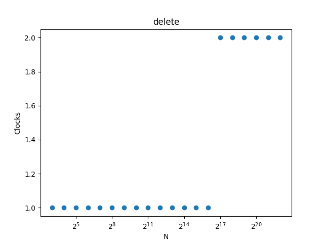
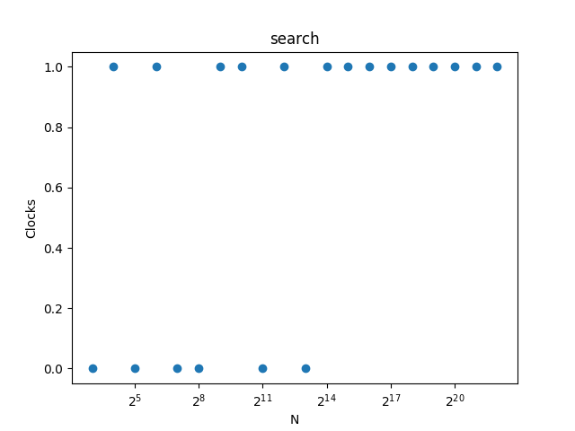
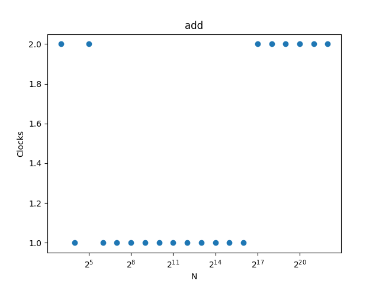
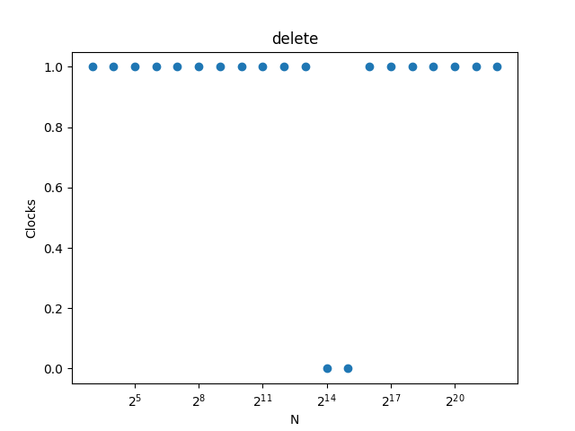
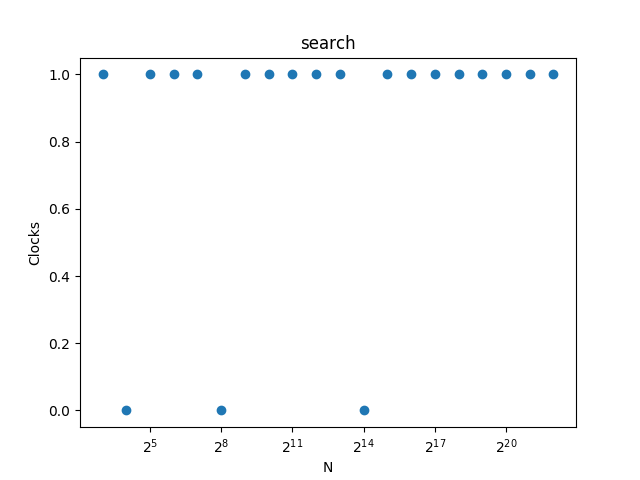
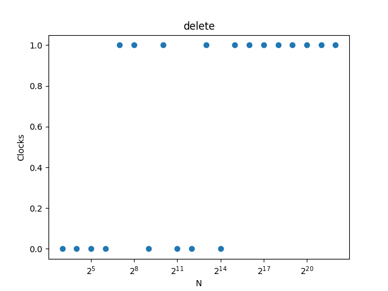
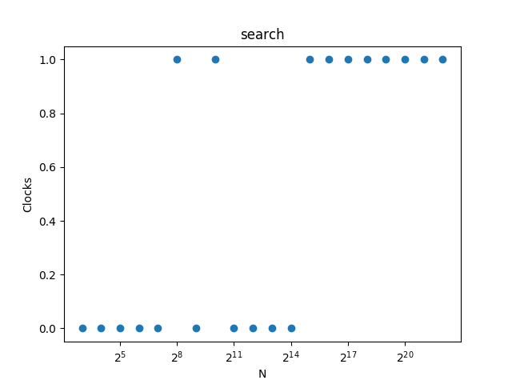

# Домашнее задание по курсу "Алгоритмы и структуры данных". 
# Сравнение хеш-таблицы с различными способами разрешения коллизий.

## Теоретическая часть
Пара -- (_ключ_, _значение_)

Хеш-табли́ца (англ. hash-table) -- структура данных, представляющая эффективную реализацию интерфейса словаря. В отличие от деревьев поиска, реализующих тот же интерфейс, обеспечивают меньшее время отклика в среднем. Представляет собой эффективную структуру данных для реализации словарей, а именно, она позволяет хранить пары и выполнять три операции: добавления новой пары, поиска и удаления пары по ключу. Хеширование представляет собой исключительно эффективную и практичную технологию: в среднем все базовые операции выполняются за _O(1)_.

Хеш-таблица содержит некоторый массив _H_, в элементах которого хранятся пары. Выполнение операции в хеш-таблице начинается с вычисления значения хеш-функции от ключа _h = hash(key)_, которое играет роль индекса в массиве _H_. Затем выполняемая операция (добавление, удаление или поиск) перенаправляется объекту, который хранится в соответствующей ячейке массива _H_.

Два ключа могут быть хешированы в одну и ту же ячейку. Такая ситуация называется коллизией. Имеются эффективные технологии разрешения коллизий:
* При разрешении коллизий с помощью метода цепочек (separate chaining) в элементах массивах может хранится любая структура данных, поддерживающая требуемые операции (вставку, удаление, поиск). 
Наихудшее время общих операций хеш-таблицы будет зависет от выбранной структуры.Однако это вносит дополнительную сложность в реализацию и может привести к еще большей производительности для небольших хеш-таблиц, где время, затрачиваемое на добавление и балансирование дерева, больше, чем время, необходимое для выполнения линейного поиска по всем элементам списка.
* В методе открытой адресации (open addressing), все пары хранятся в самом массиве _H_. 
При операции на словарем происходит проверка ячеек массива _H_ в некотором порядке. Последовательность, в которой просматриваются ячейки хеш-таблицы, называется последовательностью проб и в общем случае зависит только от ключа элемента. Для успешной работы алгоритмов поиска последовательность проб должна быть такой, чтобы все ячейки хеш-таблицы оказались просмотренными ровно по одному разу.

### Separate chaining with linked lists a.k.a. **chain**
Каждая ячейка массива _H_ является указателем на связный список (цепочку) пар, соответствующих одному и тому же хеш-значению ключа. Коллизии приводят к тому, что появляются цепочки длиной более одного элемента. В случае, если коэффициент заполнения станет слишком велик, следует увеличить размер массива _H_ и перестроить таблицу.

### Двойное хеширование a.k.a. **double_hash**
Двойное хеширование (англ. double hashing) — метод борьбы с коллизиями, возникающими при открытой адресации, основанный на использовании двух хеш-функций для построения различных последовательностей исследования хеш-таблицы.
Интервал между пробируемыми ячейками фиксирован и равен значению вспомогательной хеш-функции, поэтому может быть различным для разных ключей. Значения этой хеш-функции должны быть ненулевыми и взаимно-простыми с размером хеш-таблицы.

### Кукушкино хеширование a.k.a. **cuckoo**
Кукушкино хеширование является видом открытой адресации. Однако открытая адресация страдает от коллизий, которые случаются, когда более одного ключа попадают в одну ячейку. Основная идея кукушкиного хеширования заключается в разрешении коллизий путём использования двух хеш-функций вместо одной. Это обеспечивает два возможных положения в хеш-таблице для каждого ключа. В одном из обычных вариантов алгоритма хеш-таблица разбивается на две меньшие таблицы меньшего размера и каждая хеш-функция даёт индекс в одну из этих двух таблиц. Можно обеспечить также для обеих хеш-функций индексирование внутри одной таблицы.

## Инструкция
Для компиляции используется  [CMake](https://cmake.org/). 
Для юнит-тестов используется фреймворк [googletest](https://github.com/google/googletest) (загружается во время настройки сборки) и [Python 3](https://python.org/).

Исполняемые файлы **chain**, **double_hash** и **cuckoo** отличаются используемой реализации хеш-таблицы. **stl_wrapper** нужен для проверки корректности сгенерированного файла ответа.

### Анализ
**scripts/generator.py** предназначен для генерации больших объемов входных данных (создание хеш-таблицы, ее заполнение 2<sup>i</sup> ключами, затем 10000 случайных операций). Начальный размер таблицы равен 2<sup>i+2</sup>.
Сгенерированный файл **_2<sup>i</sup>_.dat** содержит последовательность команд. Сгенерированный файл **_2<sup>i</sup>_.ans** содержит ожидаемый результат.

**scripts/test.py** (зависит от [matplotlib](https://matplotlib.org/)) анализирует время работы случайных операций из сгенерированных файлов и рисует графики зависимости времени выполнения от количества пар в таблице (файлы ***img/algname_opname.png***).

Обязательный аргумент командной строки _high_ задает максимальное значение _i_. Опциональный аргумент командной строки _low_ задает минимальное значение _i_ (по умолчанию 3).

## Логика программы
Принято, что все ключи в таблицы уникальны. Коэффициент заполнения α = 1/2.

**chain** реализует разрешение коллизий методом цепочек с односвязным списком. Новые значения добавляются в начало списка. 

**double_hash** реализует разрешение коллизий методом двойного хеширования. 

**cuckoo** реализует разрешение коллизий методом "кукушкино хеширование". Выбран вариант алгоритма, в котором используются две хеш-таблицы, и первая хеш-функция указывает на ячейку из первой таблицы, а вторая -- из второй.

В **chain** и **cuckoo** используется универсальный класс хеш-функций _H<sub>2147483659 m</sub>_, где 2147483659 -- наименьшее простое число такое, что все ключи лежат в _Z<sub>2147483659</sub>_; _m_ - размер массива, представляющего таблицу.

В **double_hash** выбраны хеш-функции _h1(key) = key mod m_ и _h2(key) = h1(key) + 1 xor h1(key) mod 2_.

## Практическая часть
Проведем сравнение рассмотренных выше реализаций хеш-таблиц.

Построим графики зависимости времени выполнения операции от количества элементов в хеш-таблице _N_.

**chain**






**double_hash**






**cuckoo**






Из графиков можно заметить следующее:
* время добавления почти не отличается;
* операция удаления и поиска в **cuckoo** выполняются незначительно быстрее;
* операция поиска минимального и максимального элементов в **double_hash** работает заметно быстрее (вероятно, это связано с удобством кеширования непрерывного массива данных по сравнению со списком в **chain** и меньшим объемом просматриваемых ячеек по сравнению с **cuckoo**).

Последнее наблюдение при высокой частоте операций поиска минимального и максимального элементов  

На основе полученных результатов можно сделать следующий вывод:
в зависимости от предполагаемой частоты операций нужно выбирать хеш-таблицы с различным способом разрешения коллизий.
Если ожидается много операций поиска минимального и максимального элементов двойное хеширование будет наиболее подходящим вариантом разрешения коллизий.
В остальных случаях высокую эффективность показывает "кукушкино" хеширование.

## Формат входных и выходных данных
В начале входного файла начальный размер хеш-таблицы.
Далее следует последовательность команд, разделенных whitespace-символами.

* ```add key value``` -- добавление элемента в хеш-таблицу (key и value -- знаковые целые 32-битные числа). Если добавление успешно, возвращает **OK**, иначе **FAIL**.

* ```delete key``` -- удаление элемента из хеш-таблицы по ключу. Если удаление успешно, возвращает **OK**, иначе **FAIL**.

* ```search key``` -- поиск элемента в хеш-таблицы по ключу. Если такой ключ существует, возвращает значение, в противном случае **null**

* ```min``` -- поиск пары с минимальным значение. Возвращает пару, разделенную пробелом (строку вида "__*key value*__"). Если таблица пустая, возвращает **null**.

* ```max``` -- поиск пары с максимальным значением. Возвращает пару, разделенную пробелом (строку вида "__*key value*__"). Если таблица пустая, возвращает **null**.

* ```print``` -- печать внутреннего строения структуры.

В стандартный поток ошибок после каждой операции с новой строки через пробел записывается команда, количество элементов в хэш-таблице до операции и количество тиков процессора за операцию.

### Формат вывода команды print
#### **chain**
Для каждой _i_-той ячейки массива _H_ в строчку записаны пары `key value` с разделителем `->` в том же порядке, что и в соответствующем списке структуры
```
[0]
[1]->28 28->15 15
[2]->31 31->22 22
[3]
[4]->10 10
[5]->17 17->4 4
[6]->59 59
[7]->88 88
```

#### **double_hash**
Для каждой ячейки _i_-той ячейки в строчку записана пара `key value`. Если элемент из ячейки был удален, она помечается как `DELETED`.
```
[0]
[1]
[2]10 10
[3]
[4]
[5]
[6]DELETED
[7]31 31
```

#### **cuckoo**
Для каждой ячейки _i_-той ячейки в строчку записаны две пары `key value` (из двух таблиц соответственно), разделенные табуляцией
```
[0]		
[1]			31 31
[2]22 22
[3]		
[4]		
[5]		
[6]		
[7]10 10
```

## Оценка сложности основных алгоритмов
Обозначения:
* _m_ - размер массива _H_
* _N_ - количество элементов в хеш-таблице
* _α = N/m_ - коэффициент заполнения

### **chain**
Время операций вставки, удаления и поиска _Θ(1 + N/m)_

#### Доказательство
Время вычисления хеш-функции равно _Θ(1)_.

При равномерном хешировании любой ключ может быть помещен с равной вероятностью в любую из _m_ ячеек. Математическое ожидание длины списка составляет _N/m_, поэтому поиск в спиcке осуществляется за _O(N/m)_, вставка и удаление имеют такую же сложность из аналогичных соображений (при каждой операции происходит проверка есть ли данный ключ в списке).

### **double_hash**
Время операций вставки, удаления и поиска _O(1 / 1 - α)_

#### Доказательство
Время вычисления хеш-функции равно _Θ(1)_.

Назовем _h<sub>i</sub>_ номер _i_-той по порядку пробирования ячейку 
При равномерном хешировании любой ключ может быть помещен с равной вероятностью в любую из _m_ ячеек. Ячейка _h<sub>0</sub>_ занята с вероятностью _α_. Вероятность, что заняты ячейки _h<sub>0</sub>_ и _h<sub>1</sub>_ равна _α<sup>2</sup>_. Вероятность, что заняты _i_ ячеек равна _α<sup>i-1</sup>_. Таким образом, ожидаемое количество исследований не превышает _Σ<sub>1</sub><sup>∞</sup>α<sup>i-1</sup> = Σ<sub>0</sub><sup>∞</sup>α<sup>i</sup> = (1 / 1 - α)_.

### **cuckoo**
Время операций вставки, удаления и поиска _O(1)_

#### Доказательство
Время вычисления хеш-функции равно _Θ(1)_.

Удаление и поиск происходят за _O(1)_ (что является основной особенностью данного типа хеширования), т.к. требуется проверить 2 ячейки таблицы.  

Добавление в среднем происходит за _O(1)_. Один из способов доказательства данного утверждения использует теорию случайных графов. Это делается через неориентированный "кукушкин граф", где каждой ячейке хеш-таблицы соответствует ровно одна вершина, а каждому добавленному элементу -- ребро с концами в вершинах, соответствующих ячейкам, в которые указывают хеш-функции элемента. При этом элемент будет добавлен без перехеширования тогда и только тогда, когда после добавления нового ребра граф будет оставаться псевдолесом, то есть каждая его компонента связности будет содержать не более одного цикла. 

Доказательство через теорию вероятности в [первоисточнике](http://citeseerx.ist.psu.edu/viewdoc/download?doi=10.1.1.25.4189&rep=rep1&type=pdf).

## Оценка использования памяти основными алгоритмами
Обозначения:
* _m_ - размер массива _H_
* _N_ - количество элементов в хеш-таблице
* _α = N/m_ - коэффициент заполнения

### **chain**
Используется _Θ(m + N)_ памяти

#### Доказательство
Очевидно, что _m_ памяти использовано массивом _H_.
На каждый элемент в таблице нужно еще дополнительно _Θ(1) * N = Θ(N)_ памяти под указатели в списке. 

### **double_hash** и **cuckoo**
Используется _Θ(m)_ памяти. Это преимущество метода открытой адресации.

#### Доказательство
Очевидно, что _m_ памяти использовано массивом _H_. Дополнительная память не используется.

## Список источников
1. Кормен, Т., Лейзерсон, Ч., Ривест, Р., Штайн, К. "Алгоритмы: построение и анализ"
2. https://en.wikipedia.org/wiki/Hash_table
3. https://neerc.ifmo.ru/wiki/index.php?title=%D0%A5%D0%B5%D1%88-%D1%82%D0%B0%D0%B1%D0%BB%D0%B8%D1%86%D0%B0
4. http://citeseerx.ist.psu.edu/viewdoc/download?doi=10.1.1.25.4189&rep=rep1&type=pdf
5. https://neerc.ifmo.ru/wiki/index.php?title=%D0%A5%D0%B5%D1%88%D0%B8%D1%80%D0%BE%D0%B2%D0%B0%D0%BD%D0%B8%D0%B5_%D0%BA%D1%83%D0%BA%D1%83%D1%88%D0%BA%D0%B8
